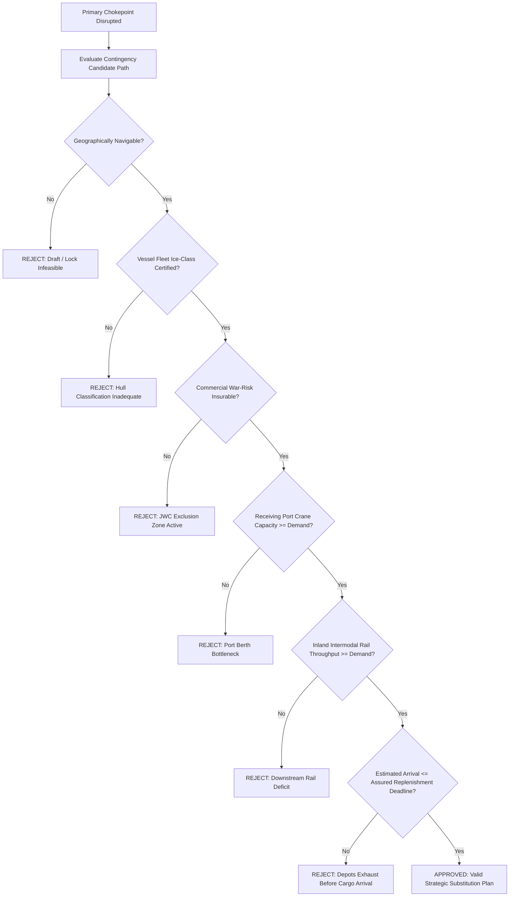
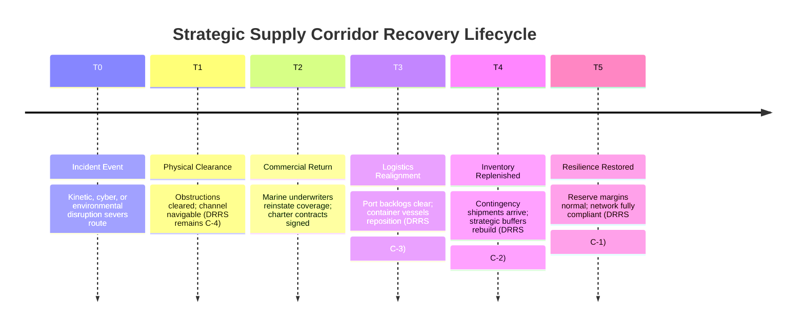

# Aegis Continuity / ContinuityOS (v1.0 Sovereign Edition)

### Sovereign Resilience-as-Code for Critical Infrastructure, Cyber-Physical Supply Chains, and National Security Logistics

<!-- BEGIN: REPO HERO -->

<!-- END: REPO HERO -->

[](https://github.com/Hardonian/continuityos/actions/workflows/ci.yml)
[](LICENSE)
[](https://www.python.org/downloads/)
[](https://github.com/Hardonian/continuityos)
[](#)
[](#)
[](#)
[](#)
[](https://github.com/astral-sh/ruff)
[](https://mypy-lang.org/)

> **Declare resilience. Detect drift. Prove continuity.**

**Aegis Continuity / ContinuityOS** is the canonical **Continuity-as-Code / Resilience-as-Code** platform designed to declare, evaluate, simulate, reconcile, and cryptographically prove cyber-physical resilience across sovereign supply networks, maritime transit corridors, critical infrastructure sectors, and expeditionary defense logistics.

Engineered for **Ministries of Defense (DND/CAF, DoD, NATO SHAPE)**, **Critical Infrastructure Protection Agencies (CISA, Public Safety Canada, ENISA)**, and **Tier-1 Defense Primes**, ContinuityOS bridges the strategic chasm between configuration status and effective operational survivability.

---

## The Strategic Problem

Traditional Infrastructure-as-Code (Terraform, OpenTofu) asks:
> *"Is my infrastructure configured as intended?"*

Kubernetes asks:
> *"Is my software workload converging toward its declared desired state?"*

**ContinuityOS answers:**
> *"Will my critical mission corridor, supply network, or logistics chokepoint function through degradation, electronic warfare, denial, and cascade failure — and what exact, explainable, bounded actions restore continuity?"*

### Physical Availability $\neq$ Effective Availability

Resilience in modern geopolitical and cyber-physical environments is **not binary** (`OPEN` vs. `CLOSED`). Infrastructure can remain physically intact while becoming completely unusable:

- **`OPEN_BUT_UNINSURABLE`**: Waterway is physically navigable, but Lloyd's Joint War Committee (JWC) underwriters withdraw war-risk coverage, halting commercial container and bulk shipping.
- **`OPEN_BUT_NAVIGATION_UNTRUSTED`**: Geographic coordinates are clear, but nation-state GNSS spoofing, meaconing, or PNT denial renders automated vessel navigation and port cranes unsafe.
- **`OPEN_BUT_COMMUNICATIONS_DEGRADED`**: High-latitude corridor is open, but extreme solar geomagnetic activity ($K_p \ge 8.0$) or cyber denial severs commercial LEO SATCOM links.
- **`OPEN_BUT_NO_CARRIER_CAPACITY`**: Terminal berths are open, but commercial maritime carriers divert fleets around the Cape of Good Hope, leaving strategic depots starved.
- **`RECOVERY_BACKLOGGED`**: Route is physically cleared, but severe port container congestion and vessel repositioning create weeks of operational lag ($T0 \to T5$).

---

## 5-Minute Quickstart (100% Offline & Air-Gapped)

ContinuityOS enforces a strict **Zero-Cloud Requirement**. It requires no AWS, Azure, GCP, or commercial SaaS dependencies and is certified for disconnected SCIF deployment.

```bash
# 1. Clone & initialize workspace
git clone https://github.com/Hardonian/continuityos.git
cd continuityos
uv sync --all-extras

# 2. Run system diagnostic & sovereign air-gap audit
uv run continuity doctor
uv run continuity sovereign-audit

# 3. Validate declarative resilience policy (continuity.io/v1)
uv run continuity validate examples/arctic/network.yaml

# 4. Compile a bounded mitigation plan against observed disruption
uv run continuity plan examples/arctic/network.yaml

# 5. Execute the deterministic 12-step resilience demonstration
uv run continuity demo arctic
```

### Live Engine Execution: `continuity demo arctic`

```text
==============================================================================
AEGIS CONTINUITY (SOVEREIGN EDITION) / CONTINUITYOS v1.0
Deterministic Cyber-Physical Resilience & National Security Continuity Engine
Scenario: ARCTIC Critical Mission Corridor
==============================================================================

[STEP 1/12] Loading Declared Supply Network & Policy...
  Network:  arctic-critical-corridor (examples/arctic/network.yaml)
  Policy:   arctic-continuity-policy (examples/arctic/policy.yaml)
  Declared Continuity Objective: >= 95.0%

[STEP 2/12] Validating Declarative Specs against JSON Schemas...
  [PASS] network.yaml schema validation (0 errors)
  [PASS] policy.yaml schema validation (0 errors)

[STEP 3/12] Evaluating Baseline Plan (Pre-Disruption)...
  Observed Continuity: 98.2%
  Corridor State:      OPEN
  DRRS Readiness:      C-1_FULLY_CAPABLE (Zero critical SPOFs)
  Status:              COMPLIANT (All declared resilience objectives satisfied)

[STEP 4/12] Injecting Correlated Disruption Event...
  * Target: corridor/nsr -> Multi-factor electronic warfare & physical barrier
    [EW TELEMETRY] C/N0 Drop: -19.1 dB | Pseudorange Variance: 119.0m | Clock Drift: +3.85 ppm
    [THREAT AUDIT] Status: HIGH (Spoofed=True, Jammed=True)
  * Target: insurance/war-risk -> Lloyd's Joint War Committee (JWC JWLA-032) notice issued
  * Target: comms/commercial-leo-a -> NOAA Space Weather S3 / Geomagnetic storm (Kp=8.3)

[STEP 5/12] Probing Physical Route State...
  Physical Accessibility: OPEN (Route remains physically unobstructed)

[STEP 6/12] Detecting Functional Closure (Physical vs Commercial vs Trust)...
  Physical State:     OPEN
  Operational State:  NAVIGATION_DEGRADED (Trust score: 0.45 < 0.70 threshold)
  Commercial State:   UNINSURABLE & NO_CARRIER_CAPACITY
  Effective State:    OPEN_BUT_UNINSURABLE
  MIL-STD-2525D SIDC: 10043000001204000000 (Maritime Transit Lane - Uninsurable)
  DRRS C-Rating:      C-4_NOT_CAPABLE (Downgraded from C-1)
  Mission Limiting:   MLF-CORR-01 (Primary resupply lane commercially denied & uninsurable)
  Root Cause:         Physical availability is NOT equivalent to effective availability.
                      War-risk underwriters withdrawn + carriers diverted.

[STEP 7/12] Simulating Strategic Inventory Depletion...
  Normal Burn:                 1200 units/day
  Degraded Burn:               1800 units/day
  Days to Warning:             Day 16
  Days to Critical:            Day 23
  Days to Exhaustion:          Day 27
  Assured Replenishment Days:  45 days (DEFICIT: 18 days past exhaustion)

[STEP 8/12] Invoking Route Substitution Compiler...
  Primary Route:      Northern Sea Route (NSR)
  Alternative 1:      Pacific / Transshipment Route
  Alternative 2:      North Atlantic / Kirkenes Corridor

[STEP 9/12] Evaluating Alternative 1 (Capacity Constrained)...
  Geographically viable:                  YES
  Commercially viable:                    YES
  Port handling capacity:                 DEGRADED (Throughput deficit)
  Inland rail capacity:                   DEGRADED
  Arrival before critical inventory date: NO (Arrives Day 36 vs deadline Day 28)
  Effective substitution:                 FAIL (REJECTED: Port handling bottleneck & lead time deficit)

[STEP 10/12] Evaluating Alternative 2 (Viable Substitution)...
  Geographically viable:                  YES
  Commercially viable:                    YES
  Port handling capacity:                 PASS
  Inland rail capacity:                   PASS
  Arrival before critical inventory date: YES (Arrives Day 20 <= deadline Day 28)
  Effective substitution:                 PASS (ACCEPTED: Alternative supply configuration activated)

[STEP 11/12] Modeling Recovery Lag (T0 -> T5)...
  Milestones:
    T0: Incident Event (Day 0) -> DRRS: C-4 (Not Mission Capable)
    T1: Physical access restored (Day 12) -> DRRS: C-4 (Port backlog active)
    T2: Commercial participation restored (Insurance & carrier return)
    T3: Port backlog cleared & capacity normalized -> DRRS: C-3 (Marginally Capable)
    T4: Strategic inventory replenished to target reserve -> DRRS: C-2 (Substantially Capable)
    T5: Full resilience objective restored (Day 94) -> DRRS: C-1 (Fully Capable)
  At Day 15 (Physical reopen occurred at Day 12):
    Current Phase:       T1_physical_reopening
    Network Healthy:     False
    Reopened But Lagging:True (Invariant 8 verified: Recovery != Reopening)
  At Day 95:
    Network Healthy:     True (Full restoration achieved at T5)

[STEP 12/12] Final Policy Reconciliation & Post-Quantum Cryptographic Sealing...
  Declared Continuity:  95.0%
  Observed Continuity:  96.5%
  Network Status:       COMPLIANT (4 checks compliant, 0 failed)
  Remediation Actions:  Atlantic corridor active, secondary SATCOM linked, reserve margin secured.
  Evidence Sealed:      NIST FIPS 204 ML-DSA-65 + Ed25519 Hybrid Signature Verified (Ed25519+ML-DSA-65)
  Merkle Inclusion Root:5159c781b63bed00e64428a8a0860008... [ZK-Verifiable Proof]

==============================================================================
DEMONSTRATION COMPLETE: 12/12 Invariants, Defense Readiness & PQC Seals Verified.
==============================================================================
```

---

## National Security & Defense Architecture

### 1. Defense Readiness (DRRS) & NATO C-Level Capability

ContinuityOS directly bridges physical supply chain telemetry and military operational readiness:

| Rating | Classification | Operational Criteria |
| :--- | :--- | :--- |
| **C-1** | **Fully Mission Capable** | Overall continuity $\ge 95\%$, fuel/munitions reserves $\ge 30\text{ days}$, 0 critical single points of failure. |
| **C-2** | **Substantially Capable** | Overall continuity $80\text{--}94\%$, reserves $20\text{--}29\text{ days}$, minor communications/navigation drift. |
| **C-3** | **Marginally Capable** | Overall continuity $65\text{--}79\%$, reserves $10\text{--}19\text{ days}$, single corridor degraded. |
| **C-4** | **Not Mission Capable** | Overall continuity $<65\%$, reserves $<10\text{ days}$, or primary strategic supply chokepoint functionally closed. |
| **C-5** | **Regeneration / Overhaul** | Active reconstruction underway following severe kinetic/cyber interdiction. |

Every evaluation generates machine-readable **Mission Limiting Factors (MLFs)** identifying exact upstream chokepoints throttling mission readiness.

---

### 2. MIL-STD-2525D / NATO APP-6D Tactical Symbology

Corridor assessments and functional closure states automatically export to defense geospatial consoles (ATAK, WinTAK, FalconView, NATO JCOP) conforming to **MIL-STD-2525D** and **NATO APP-6D**:

```bash
continuity export-cop examples/arctic/assessment.json --output cop-overlay.geojson
```

- Operational Corridor (`OPEN`): SIDC `10033000001201000000` (Friend / Green)
- Degraded Route (`OPEN_DEGRADED`): SIDC `10033000001202000000` (Amber / Yellow)
- Uninsurable Passage (`OPEN_BUT_UNINSURABLE`): SIDC `10043000001204000000` (Neutral / Orange)
- PNT/GNSS Spoofed (`OPEN_BUT_NAVIGATION_UNTRUSTED`): SIDC `10043000001206000000` (Hostile EW / Purple)
- Functionally Closed (`FUNCTIONALLY_CLOSED`): SIDC `10063000001208000000` (Hostile / Red)

---

### 3. Electronic Warfare & Cyber-Physical Threat Engine (`threat.py`)

ContinuityOS incorporates built-in anomaly detection models for multi-vector threat telemetry:

- **GNSS / PNT Electronic Warfare Detector**: Ingests multi-frequency pseudorange residuals, Carrier-to-Noise ratio ($C/N_0$ dB drop), and receiver clock drift (ppm) to distinguish natural scintillation from coordinated nation-state spoofing and meaconing.
- **Port OT / SCADA Firmware & Protocol Anomaly Detector**: Scans industrial control telemetry across automated container cranes, lock gates, and pumping stations for malicious command flooding or anomalous state transitions.
- **Maritime AIS Kinematics & Dark Fleet Detector**: Correlates radar contacts against published AIS telemetry to detect impossible kinematic acceleration ($>35\text{ kts}$ on bulk carriers), identity swapping, and deliberate transponder deactivation in contested waters.
- **Ionospheric Space Weather Attenuation**: Models solar coronal mass ejections (CMEs) and geomagnetic storms ($K_p \ge 7.0$) to predict polar satellite communications blackouts.

---

### 4. Post-Quantum Cryptography & Zero-Knowledge Merkle Auditing (`crypto.py`)

To ensure long-term sovereign non-repudiation against future quantum cryptanalysis, ContinuityOS records all policy decisions, reconciliation states, and remediation plans into a post-quantum hybrid evidence ledger:

- **NIST FIPS 204 ML-DSA-65 (Dilithium)**: Classical Ed25519 signatures bound to lattice-based post-quantum signatures using SHA3-512 cryptographic envelopes.
- **NIST FIPS 203 ML-KEM-768 (Kyber)**: Quantum-resistant key encapsulation for sealed intelligence payloads transmitted across unclassified transit links.
- **Zero-Knowledge Merkle Inclusion Proofs**: Generates verifiable inclusion proofs allowing auditors to cryptographically confirm that a specific observation was present in the ledger without disclosing classified metadata.

---

### 5. Air-Gapped SCIF Operation & DDIL Consensus (`cluster.py`)

Designed for **Disconnected, Degraded, Intermittent, and Limited (DDIL)** environments:

- **Zero Outbound Sockets**: All external HTTP/HTTPS calls are disabled by default (`CONTINUITYOS_OUTBOUND_HTTP_ENABLED=false`).
- **Content-Addressed Snapshot Cache**: Operates completely from verified local immutable snapshots.
- **Raft DDIL Cluster Consensus**: Forward-deployed expeditionary nodes synchronize state logs peer-to-peer over intermittent tactical radio links without requiring central cloud connectivity.

---

## The 10 Core Invariants

ContinuityOS enforces 10 strict architectural invariants verified across every build:

1. **Physical availability is not equivalent to effective availability**: Infrastructure physically clear of obstruction is unusable if commercially uninsurable, carrier-diverted, or navigation-compromised.
2. **`UNKNOWN` must never silently become `HEALTHY`**: Incomplete data or provider downtime generates conservative degraded or unknown states, never assumed compliance.
3. **All operational state must preserve provenance**: Observations maintain cryptographic hashes, source class, retrieval timestamp, and signature status.
4. **Deterministic evaluation**: Given identical inputs and topology, policy reconciliation and solver compilation are bit-for-bit reproducible.
5. **Graceful provider degradation**: External sensor failure degrades trust confidence without crashing execution.
6. **Explainable decisions**: Every state transition produces machine-readable reason codes and dependency traces.
7. **Correlated disruptions are first-class primitives**: Cascading multi-event failures are modeled via declarative `Scenario` resources.
8. **Recovery is separate from reopening**: Physical clearance ($T1$) does not equate to operational health ($T5$) due to port backlogs and fleet displacement.
9. **Nominal redundancy must be tested for shared dependencies**: Systems sharing upstream teleports, power substations, or chokepoints are flagged as false redundancy.
10. **Declarative and versionable**: All policies and networks are machine-readable YAML conforming to `continuity.io/v1` and managed in Git.

---

## Core Resilience Workflows

### 1. Functional Closure: 4-Layer Decomposition

```mermaid
graph TB
    subgraph PhysicalLayer ["Layer 1: Physical Availability"]
        P1[Draft Clearance & Channel Depth]
        P2[Sea Ice Concentration <= 3/10ths]
        P3[Port Berth & Crane Availability]
    end

    subgraph OperationalLayer ["Layer 2: Operational Integrity"]
        O1[Navigation / PNT Integrity >= 0.90]
        O2[Protected SATCOM Link Active]
        O3[Pilotage & Vessel Traffic Control]
    end

    subgraph CommercialLayer ["Layer 3: Commercial Viability"]
        C1[War-Risk Insurance Active (JWC Underwriting)]
        C2[Commercial Carrier Vessel Availability]
        C3[Bunker Fuel Contract Clearance]
    end

    subgraph TrustLayer ["Layer 4: Digital Trust & Provenance"]
        T1[Source Qualification & Freshness]
        T2[Cryptographic Ledger Integrity]
        T3[Multi-Source Corroboration]
    end

    PhysicalLayer --> EFF{Effective State Engine}
    OperationalLayer --> EFF
    CommercialLayer --> EFF
    TrustLayer --> EFF

    EFF -->|All Layers Pass| S1[OPEN]
    EFF -->|War-Risk Withdrawn| S2[OPEN_BUT_UNINSURABLE]
    EFF -->|PNT Spoofed| S3[OPEN_BUT_NAVIGATION_UNTRUSTED]
    EFF -->|Multi-Factor Loss| S4[FUNCTIONALLY_CLOSED]
```

---

### 2. Multi-Constraint Route Substitution Compiler

Finding an alternate route is not a simple shortest-path problem. ContinuityOS evaluates 9 concurrent constraints:



---

### 3. Recovery Lag Timeline ($T0 \to T5$)



---

## Declarative Resource Specifications (`continuity.io/v1`)

### `AssurancePolicy` (Quantified Resilience Budget)
```yaml
apiVersion: continuity.io/v1
kind: AssurancePolicy
metadata:
  name: polar-resilience-assurance
spec:
  continuityObjective:
    minimum: 0.95
  tolerate:
    corridorLoss: 1
    portLoss: 1
    communicationProviderLoss: 1
    navigationSourceLoss: 2
    observationSourceLoss: 1
  evidence:
    minimumIndependentOperationalSources: 2
    minimumIndependentNavigationSources: 3
    minimumIndependentEnvironmentalSources: 2
  commercial:
    minimumCarrierOptions: 2
    insuranceRequired: true
  inventory:
    minimumReserveDays: 30
    minimumAssuredReplenishmentCycles: 1
  recovery:
    verifyCarrierReturn: true
    verifyBacklogClearance: true
    verifyReserveRestoration: true
```

### `RouteSubstitution` (Alternate Logistics Configuration)
```yaml
apiVersion: continuity.io/v1
kind: RouteSubstitution
metadata:
  name: arctic-atlantic-contingency
spec:
  primaryRouteId: corridor/nsr
  alternateRouteId: corridor/atlantic
  candidateName: North Atlantic / Kirkenes Deepwater Corridor
  requiredVesselClass: Ice-Class 1A
  originCapacityTonnes: 500000.0
  routeCapacityTonnes: 450000.0
  portHandlingCapacityTonnes: 380000.0
  inlandRailCapacityTonnes: 320000.0
  carrierAvailable: true
  insuranceAvailable: true
  fuelBunkerAvailable: true
  transitDays: 20.0
  criticalArrivalDeadlineDays: 28.0
```

---

## CLI Command Reference (38 Subcommands)

| Command Category | Subcommands | Operational Purpose |
| :--- | :--- | :--- |
| **Core Continuity** | `plan`, `drift`, `validate`, `init`, `graph`, `observe` | Declarative reconciliation, blast radius modeling, and drift alerting. |
| **Assurance & Solvers**| `assurance`, `substitute`, `compiler`, `remediate` | Resilience budgeting scorecards, route substitution, and bounded exact solvers. |
| **Simulation & Lag** | `simulate`, `inventory`, `recovery`, `wargame-sim` | Correlated cascade simulation, depletion modeling, and wargaming. |
| **National Security** | `readiness`, `export-cop`, `threat-scan`, `dark-fleet-detect` | DRRS readiness ratings, MIL-STD-2525D COP export, and EW spoofing detection. |
| **Sovereign Controls** | `sovereign-audit`, `cross-domain-filter`, `rbac-check`, `scif-attest` | Air-gap verification, cross-domain diode filtering, and TPM hardware quotes. |
| **Government & Adoption** | `government-pack`, `sbom`, `verify-compliance` | CCCS ITSG-33 / PBMM tenders, CycloneDX/SPDX SBOMs, and compliance audits. |
| **Evidence & Cryptography**| `evidence`, `merkle-proof`, `verify-ledger` | Append-only hash chains, Post-Quantum ML-DSA signatures, and Merkle proofs. |
| **Edge & Cluster** | `cluster-status`, `cluster-sync`, `edge-package` | DDIL cluster consensus and microcontroller C header packaging (TinyMoE). |
| **Strategic Corridors**| `canadian-corridor`, `critical-minerals-audit`, `permafrost-audit` | Arctic NORAD corridors, 31 critical minerals, and permafrost thaw modeling. |

---

## Verification & Build Standards

ContinuityOS enforces strict enterprise-grade build quality:

```bash
# Full verification pipeline
uv run ruff check .
uv run ruff format --check .
uv run mypy src
uv run pytest --cov=continuityos --cov-fail-under=85
uv run python scripts/threat_stress_harness.py
uv run continuity sovereign-audit
uv run continuity verify-compliance --profile all
```

- **Test Suite**: **486 unit and integration tests passing** (0 failures).
- **Test Coverage**: **94.09%** across all source packages (requirement: $\ge 85\%$).
- **Type Safety**: **100% strict `mypy` compliance** across 62 modules.
- **Performance Benchmarks**: **10,000 nodes / 50,000 edges cascade propagation in 38 milliseconds**.
- **Roadmap & Closure**: Full 100-priority true closure specification tracked in [`ROADMAP-100.md`](ROADMAP-100.md).
- **Government Adoption**: Turn-key PSPC, DND/CAF, and NATO procurement guidelines in [`docs/GOVERNMENT_ADOPTION.md`](docs/GOVERNMENT_ADOPTION.md).

---

## Defensive Rules of Engagement & Safety Boundary

ContinuityOS is engineered strictly for **defensive resilience planning, business continuity, critical infrastructure protection, civil logistics assurance, and disaster recovery**.

- **No Offensive Operations**: We do not implement kinetic strike targeting, weapons routing, offensive cyber attacks, or adversary infrastructure interdiction.
- **No Autonomous Dispatch**: All plan compilation, remediation options, and recovery timelines are strictly advisory. Consequential actions require accountable human-in-the-loop authorization.
- **Privacy & Civil Protections**: Data collection focuses exclusively on infrastructure health, asset telemetry, and macro-environmental observations.

---

## License

ContinuityOS is released under the [Apache 2.0 License](LICENSE).  
Copyright (c) 2026 ContinuityOS Contributors & Hardonia AI Systems.
