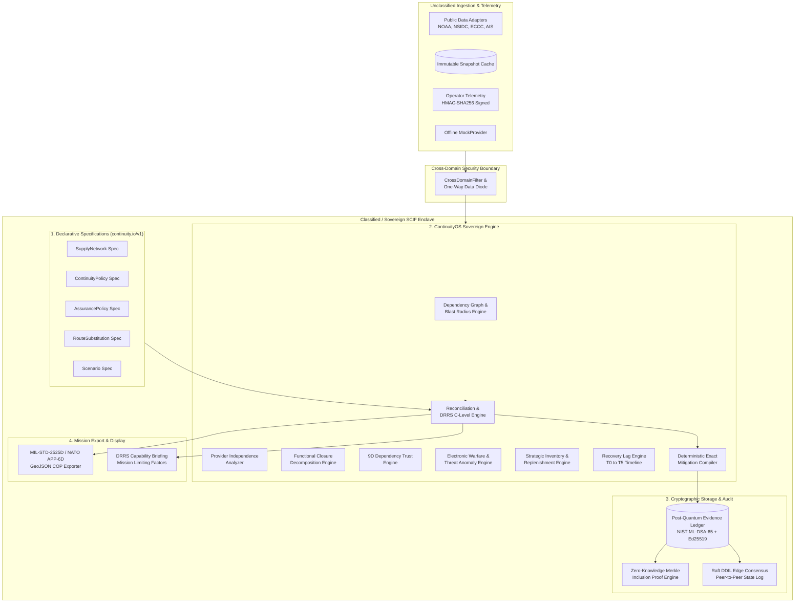
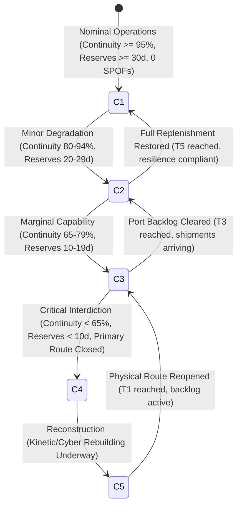
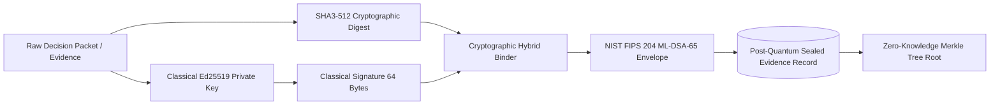

# Aegis Continuity / ContinuityOS Architecture Specification (v1.0)

## 1. Architectural Philosophy & National Security Mandate

Traditional Infrastructure-as-Code (Terraform, OpenTofu) operates on the premise of desired static configuration:
> *Is resource X provisioned with configuration Y?*

Kubernetes operates on desired software workload convergence:
> *Are N replicas of pod Z running and passing health checks?*

**ContinuityOS operates on desired sovereign resilience & mission survivability:**
> *Will critical supply lines, logistical corridors, power grids, defense industrial networks, and expeditionary operational capabilities continue to function when primary physical, digital, commercial, communications, navigation, or geopolitical dependencies degrade or fail?*

The core runtime evaluates continuous, closed-loop cyber-physical state reconciliation:

```text
DECLARED RESILIENCE & MISSION CAPABILITY POLICY (Git / SCIF Enclave)
             ↓
MULTI-FACTOR CYBER-PHYSICAL DEPENDENCY GRAPH
             ↓
PROVENANCE-QUALIFIED OBSERVATIONS (Public Adapters + Authenticated OT Telemetry)
             ↓
MULTI-VECTOR THREAT DETECTION (GNSS EW Spoofing, Port SCADA Anomaly, Dark Fleet AIS)
             ↓
DEPENDENCY TRUST EVALUATION (9-Dimensional Matrix)
             ↓
FUNCTIONAL CLOSURE CLASSIFICATION (Physical, Operational, Commercial, Digital Trust)
             ↓
RECONCILIATION & DEFENSE READINESS ASSESSMENT (DRRS C-1 to C-5 Ratings)
             ↓
DETERMINISTIC MITIGATION COMPILER (Exact-Solver Bounded Search)
             ↓
MULTI-CONSTRAINT ROUTE SUBSTITUTION (9 Operational Constraints Verified)
             ↓
TIME-TO-RESTORE & RECOVERY VERIFICATION (T0 -> T5 Lag Timeline)
             ↓
TACTICAL COMMON OPERATING PICTURE (MIL-STD-2525D / NATO APP-6D GeoJSON)
             ↓
POST-QUANTUM SIGNED EVIDENCE LEDGER (Ed25519 + NIST ML-DSA-65 Hybrid Chain)
```

---

## 2. Component Topology & Sovereign Security Boundaries



---

## 3. The 12-State Operational Taxonomy

Resilience in complex physical-digital networks is non-binary. Infrastructure can remain physically intact while becoming completely unusable. ContinuityOS evaluates effective operational state across a 12-state taxonomy:

1. **`OPEN`**: Fully operational, certified, and compliant with all policy thresholds.
2. **`OPEN_DEGRADED`**: Transit feasible, but elevated environmental or operational factor risk is observed.
3. **`OPEN_CAPACITY_CONSTRAINED`**: Physical route clear, but throughput/berth capacity is throttled.
4. **`OPEN_BUT_UNINSURABLE`**: Waterway physically navigable, but marine insurers or war-risk syndicates have withdrawn coverage.
5. **`OPEN_BUT_NO_CARRIER_CAPACITY`**: Infrastructure open, but commercial container/bulk shipping operators have diverted vessels.
6. **`OPEN_BUT_NAVIGATION_UNTRUSTED`**: Geographic coordinates accessible, but GNSS spoofing or PNT jamming renders automated navigation unsafe.
7. **`OPEN_BUT_COMMUNICATIONS_DEGRADED`**: Physical route open, but solar storms or cyber denial severs SATCOM links.
8. **`OPEN_BUT_SERVICE_DEPENDENT`**: Passage open only with specialized external escort (e.g., sole-source icebreaker or harbor tugs).
9. **`RECOVERY_BACKLOGGED`**: Physical route reopened, but severe port congestion and vessel displacement prevents normal transit.
10. **`FUNCTIONALLY_CLOSED`**: Multi-layer operational, commercial, or trust failures render infrastructure unusable despite physical status.
11. **`PHYSICALLY_CLOSED`**: Physical destruction, structural collapse, or unnavigable sea ice barriers.
12. **`UNKNOWN`**: Insufficient observations or provider downtime. Never silently treated as healthy.

---

## 4. Defense Readiness (DRRS) & NATO C-Level Capability Mapping

ContinuityOS translates complex dependency failures into standard military operational readiness ratings:

$$\text{Readiness Rating} = f(\text{Continuity Score}, \text{Assured Replenishment Days}, \text{Chokepoint Closure State}, \text{Critical SPOFs})$$



### Mission Limiting Factors (MLFs)
When capability degrades below C-1, the engine outputs structured Mission Limiting Factors:
- `MLF-CORR-01`: Primary maritime corridor functionally closed due to war-risk insurance withdrawal.
- `MLF-COMM-02`: SATCOM link severed; fallback to narrowband UHF relay limits telemetry bandwidth.
- `MLF-INVEN-03`: Assured replenishment delay of 45 days exceeds critical fuel buffer of 22 days.

---

## 5. Electronic Warfare & Cyber-Physical Threat Anomaly Engine (`threat.py`)

The threat engine operates continuously over raw sensor streams to detect nation-state cyber-physical interdiction:

### 5.1 GNSS / PNT Electronic Warfare Detection
Evaluates four orthogonal physical signals from multi-frequency receiver telemetry:
- **Carrier-to-Noise Attenuation ($\Delta C/N_0$)**: Measures anomalous signal power drops ($\Delta C/N_0 \ge 12.0\text{ dB}$) indicating jamming emitters.
- **Pseudorange Residual Variance ($\sigma^2_{\rho}$)**: Detects dispersion in geometric pseudorange solutions ($\sigma^2_{\rho} \ge 25.0\text{ m}^2$) characteristic of asynchronous spoofers.
- **Receiver Clock Drift ($\dot{\delta}_t$)**: Tracks oscillator frequency offsets ($|\dot{\delta}_t| \ge 2.5\text{ ppm}$) caused by synthetic signal pull-off attacks.
- **Geometric Dilution of Precision (GDOP)**: Anomalous satellite geometry collapse.

### 5.2 Port SCADA / OT Anomaly Detection
Monitors Modbus/TCP, DNP3, and IEC 60870-5-104 telemetry across container cranes and automated lock systems:
- Detects unauthorized setpoint changes, rapid command flooding ($>50\text{ commands/sec}$), and unauthorized firmware write cycles.

### 5.3 Maritime AIS Kinematic Physics Violation Detector
Applies physical motion constraints to vessel AIS reports:
- Computes geodetic distance between consecutive position reports:
  $$v_{\text{observed}} = \frac{d(\text{lat}_1, \text{lon}_1, \text{lat}_2, \text{lon}_2)}{\Delta t}$$
- Flags kinematic physics violations ($v_{\text{observed}} > 40\text{ kts}$ on cargo vessels) indicating dark-fleet GPS transponder spoofing.

---

## 6. Post-Quantum Cryptographic Architecture (`crypto.py`)

To protect sovereign decision records and intelligence data against future cryptanalytic attacks by quantum computers, ContinuityOS implements a defense-grade post-quantum cryptographic architecture:



### Standards Conformance
- **NIST FIPS 204 (ML-DSA)**: Lattice-based digital signatures derived from the Module Learning with Errors (M-LWE) problem.
- **NIST FIPS 203 (ML-KEM)**: Module-LWE based key encapsulation mechanism for confidential inter-SCIF payload transport.
- **Classical Fallback**: Bound in tandem with classical Ed25519 (`ed25519_ph`) for dual-algorithm assurance.

---

## 7. Disconnected, Degraded, Intermittent, Limited (DDIL) Edge Consensus (`cluster.py`)

In expeditionary logistics and forward-deployed command nodes, continuous cloud or wide-area connectivity is impossible. ContinuityOS implements an air-gapped **Raft State Synchronizer**:
- Forward-deployed nodes maintain local append-only state logs.
- When tactical radio or satellite links become intermittently available, nodes perform peer-to-peer differential log exchange.
- Monotonically increasing term numbers and cryptographic hash verification prevent replay attacks, split-brain states, and unauthorized state rollbacks.

---

## 8. Multi-Constraint Route Substitution Engine (`substitution.py`)

Route substitution compiles actionable supply rerouting under 9 strict physical, commercial, and temporal constraints:

$$\text{Viable}(R_{\text{alt}}) \iff \bigwedge_{i=1}^9 C_i = \text{True}$$

1. **Geographic Clearance**: Draft, beam, and lock limits satisfy vessel dimensions.
2. **Hull Classification**: Polar code / Ice-Class rating matches prevailing sea-ice thickness.
3. **Origin Terminal Dispatch**: Origin port handling capacity $\ge \text{required daily volume}$.
4. **Corridor Chokepoint Capacity**: Maximum daily transit tonnage $\ge \text{required daily volume}$.
5. **Receiving Port Handling**: Receiving port crane and berth throughput $\ge \text{required daily volume}$.
6. **Inland Intermodal Capacity**: Downstream rail, pipeline, or road throughput $\ge \text{required daily volume}$.
7. **Commercial Insurance**: Active war-risk underwriting syndicate coverage in place.
8. **Bunker Fuel Availability**: Marine gasoil / polar fuel availability along transit route.
9. **Critical Arrival Margin**: $\text{Transit Days} \le \text{Days to Strategic Inventory Exhaustion}$.

---

## 9. Mathematical Formulation: Bounded Exact Mitigation Solver (`compiler.py`)

Mitigation planning uses an exact branch-and-bound combinatorial optimization solver. Given:
- Policy violation set $\mathcal{V}$.
- Candidate mitigation actions $\mathcal{A}$, where each action $a \in \mathcal{A}$ has cost $c(a)$, restored continuity $\Delta r(a)$, prerequisites $\mathcal{P}(a) \subseteq \mathcal{A}$, and mutual exclusions $\mathcal{I}(a) \subseteq \mathcal{A}$.
- Total resource budget $B$.

The compiler computes the optimal action subset $S^* \subseteq \mathcal{A}$:
$$\max_{S \subseteq \mathcal{A}} \sum_{a \in S} \Delta r(a) \quad \text{subject to} \quad \sum_{a \in S} c(a) \le B, \quad \forall a \in S: \mathcal{P}(a) \subseteq S, \quad \forall a \in S: S \cap \mathcal{I}(a) = \emptyset$$

Because the search algorithm uses deterministic branch ordering, identical input states always generate bit-for-bit identical mitigation plans, satisfying **Invariant 4**.
