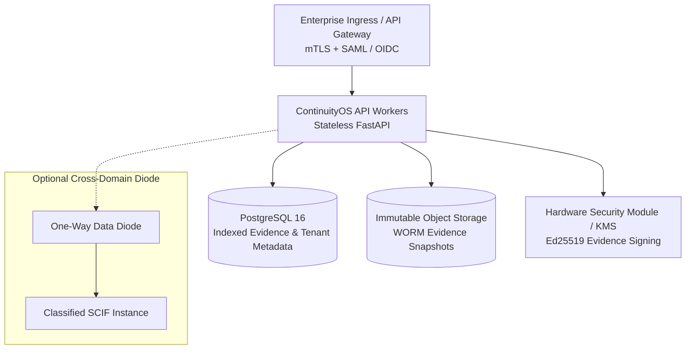

# ContinuityOS Deployment Guide (v1.0)

ContinuityOS supports three primary deployment profiles:
1. **Local CLI (Zero-Cloud / Air-Gapped Workstation)**: Standalone binary/package execution with zero external network connectivity.
2. **Containerized Edge / SCIF Appliance**: Hardened Docker / Podman container operating on isolated edge servers or SCIF enclaves.
3. **Enterprise Resilience Platform**: High-availability multi-tenant deployment orchestrated via Kubernetes with PostgreSQL persistence.

---

## 1. Zero-Cloud / Air-Gapped Workstation Deployment

ContinuityOS enforces a strict **Zero-Cloud Requirement**: the core engine never requires AWS, Azure, GCP, or commercial SaaS to function.

### Offline Installation
1. On an internet-connected workstation, build or download the wheel and dependencies:
   ```bash
   uv pip download continuityos --dest ./offline_wheels
   ```
2. Transfer `./offline_wheels` via approved air-gap data diode or optical media into the isolated SCIF enclave.
3. Install offline:
   ```bash
   pip install --no-index --find-links ./offline_wheels continuityos
   ```
4. Verify environment integrity:
   ```bash
   continuity doctor
   continuity sovereign-audit
   ```

### Running Air-Gapped
- Ingest synthetic or local telemetry:
  ```bash
  continuity observe --mock --scenario normal
  ```
- Run local simulation and mitigation planning:
  ```bash
  continuity plan examples/arctic/network.yaml
  continuity simulate examples/arctic/scenario.yaml --days 90
  ```
- Verify local signed evidence ledger:
  ```bash
  continuity evidence verify
  ```

---

## 2. Hardened Container Deployment

ContinuityOS includes a rootless, minimal Docker container:

```bash
# Build the container
docker build -t continuityos:1.0.0 .

# Run with outbound networking disabled (air-gapped container mode)
docker run -d \
  --name continuityos \
  --network none \
  -p 8080:8080 \
  -v $(pwd)/var/evidence:/app/var/evidence \
  -e CONTINUITYOS_OUTBOUND_HTTP_ENABLED=false \
  continuityos:1.0.0
```

### Health & Liveness Checks
- Cheap supervisor liveness: `GET /livez`
- Runtime storage and ledger readiness: `GET /readyz`
- Operational metrics: `GET /metrics`

---

## 3. Enterprise Production Topology

For enterprise operations across distributed logistics teams:



### Key Production Controls
- **Least Privilege**: Application runs as non-root user `continuityos` (UID 10001).
- **Read-Only Filesystem**: Container root is mounted read-only; mutable state is restricted to explicit volume mounts (`/app/var`).
- **Cryptographic Key Isolation**: Production deployments store Ed25519 signing keys in hardware security modules (HSM) or sovereign key vaults.
- **Idempotency & Anti-Replay**: Protected mutation endpoints enforce `Idempotency-Key` headers and monotonically increasing sequence counters.
