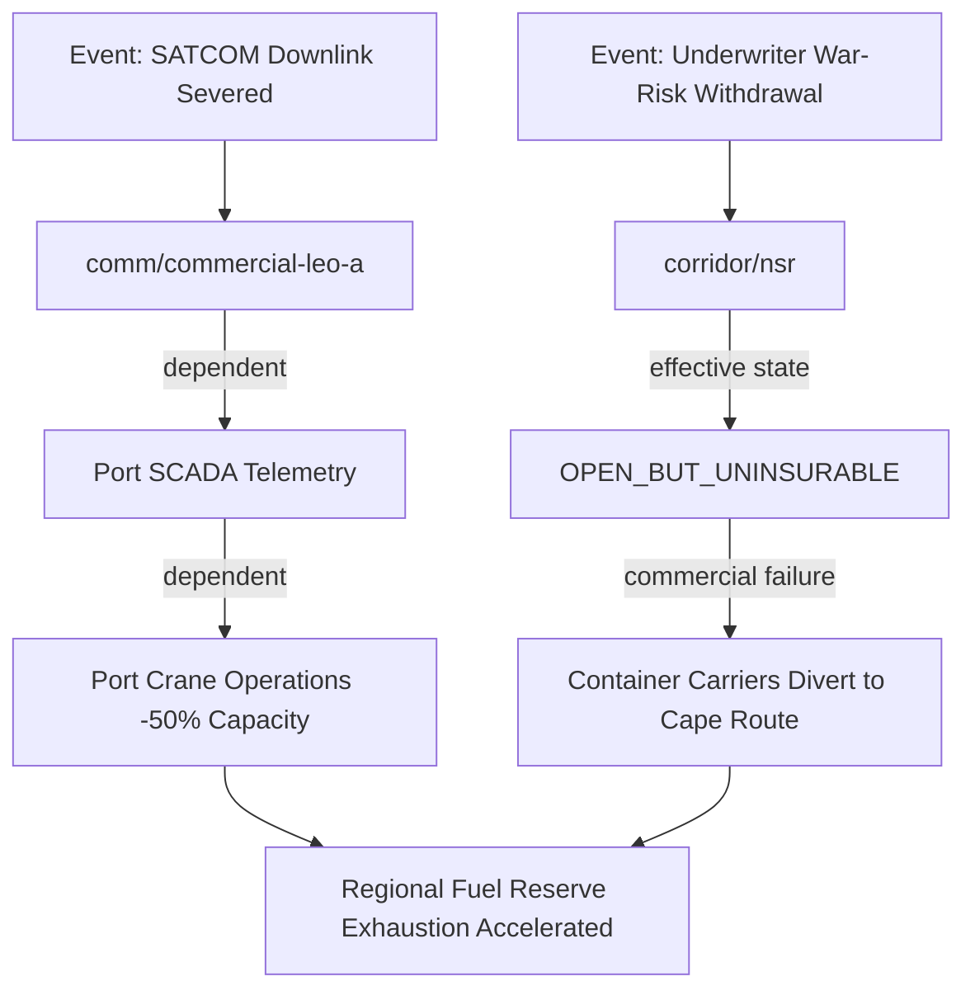

# ContinuityOS Scenario Modeling & Cascade Simulation (`scenario.py`)

Real-world crises rarely occur in isolation. Cyber operations, geopolitical tensions, severe weather, and infrastructure failures correlate across maritime corridors, communication constellations, and ports.

ContinuityOS provides a **defensive-only** correlated failure simulation engine that propagates multi-event disruptions through dependency graphs, models cascade blast radiuses, forecasts strategic inventory exhaustion, and tests route substitution feasibility.

---

## 1. Declarative Scenario Syntax

A `Scenario` resource specifies one or more disruption events applied at specific points in time:

```yaml
apiVersion: continuity.io/v1
kind: Scenario
metadata:
  name: arctic-multi-chokepoint-failure
  version: "1.0.0"
spec:
  description: "Correlated disruption across high-latitude SATCOM, NSR icebreaker escort, and canal rerouting"
  events:
    - target: comm/commercial-leo-a
      state: UNAVAILABLE
      effectiveState: PHYSICALLY_CLOSED
      delayDays: 0

    - target: corridor/nsr
      state: DEGRADED
      effectiveState: OPEN_BUT_NAVIGATION_UNTRUSTED
      delayDays: 4

    - target: corridor/suez
      state: FUNCTIONALLY_CLOSED
      effectiveState: FUNCTIONALLY_CLOSED
      delayDays: 12
```

---

## 2. Cascade Propagation Engine

When a scenario is simulated against a `SupplyNetwork` and `DependencyGraph`:

1. **Direct Event Injection**: The engine mutates the initial state of target nodes (e.g. `comm/commercial-leo-a` $\to$ `UNAVAILABLE`).
2. **Topological Cascade**: Traverses all downstream dependent edges. If node $X$ depends on node $Y$, and node $Y$ fails without an independent redundant fallback, node $X$'s effective state is degraded or severed.
3. **Blast Radius Analysis**: Identifies all affected operational corridors, ports, and manufacturing facilities.
4. **Aggregate Capacity Recomputation**: Sums the remaining throughput across surviving viable routes.
5. **Inventory Depletion Impact**: Evaluates whether active inventories will breach critical reserve thresholds before surviving routes can deliver replacement shipments.



---

## 3. Time-Stepped Simulation CLI

Simulate multi-day disruption progressions:

```bash
continuity simulate examples/arctic/scenario.yaml --days 90
```

### Simulated Timeline Output
```text
================================================================================
CONTINUITYOS CORRELATED DISRUPTION SIMULATION (90 DAYS)
================================================================================
Scenario: arctic-multi-chokepoint-failure
Initial Corridors: 3 | Viable Corridors: 1 | Aggregate Capacity Loss: 68.4%

DAY 0:
  [EVENT] comm/commercial-leo-a marked UNAVAILABLE
  Cascade: Telemetry integrity falls to 0.40; failover to sovereign UHF relay

DAY 4:
  [EVENT] corridor/nsr GNSS spoofing detected (Navigation trust: 0.55 < 0.90)
  Effective State: OPEN_BUT_NAVIGATION_UNTRUSTED
  Commercial impact: Marine underwriters issue war-risk exclusion notice

DAY 8:
  Effective State: corridor/nsr marked FUNCTIONALLY_CLOSED
  Commercial carriers halt polar transits; traffic diversion begins

DAY 13:
  [INVENTORY] Polar Diesel Depot enters WARNING state (Remaining stock: 26 days)
  Burn rate adjusted to emergency consumption (1,600 tonnes/day)

DAY 22:
  [INVENTORY] Critical reserve breached (14 days of fuel remaining)
  Policy Violation: INV-003 triggered

DAY 29:
  [SUBSTITUTION] Alternative Atlantic Route contingency activated
  Validation check: Port handling capacity PASS; transit time: 28 days

DAY 43:
  First replacement cargo vessel docks at Tromso logistics terminal
  Fuel inventory begins rebuilding

DAY 62:
  Inventory reserve restored above minimum threshold (30 days)

DAY 71:
  Recovery phase complete; network returns to COMPLIANT
================================================================================
```

---

## 4. Golden Scenarios Reference (v1.0 Test Suite)

ContinuityOS validates 10 standard golden scenarios across its automated test suite (`tests/test_golden_scenarios.py`):

| Scenario | Disruption Mechanism | Expected System Response |
| :--- | :--- | :--- |
| **A. Commercial LEO Loss** | Satellite constellation outage | Fallback to protected SATCOM; network remains compliant |
| **B. False Redundancy** | Disparate providers share ground teleport | Analyzer detects shared node; downgrades redundancy |
| **C. Open / Uninsurable** | Route clear, war-risk coverage revoked | Physical `OPEN`, Commercial `UNAVAILABLE`, Effective `FUNCTIONALLY_CLOSED` |
| **D. Correlated Failure** | Simultaneous chokepoint closures | Alternate route capacity exhausted; blast radius quantified |
| **E. Inventory Depletion** | Replenishment corridor severed | Outputs Warning (Day 13), Critical (Day 22), Exhaustion dates |
| **F. Nominal Reopening** | Corridor physically reopens at T1 | System remains degraded during backlog clearance until T5 |
| **G. Conflicting Evidence** | Disparate observations from 2 sources | Surfaces uncertainty score; avoids false healthy assumption |
| **H. Valid Substitution** | Candidate satisfies all 9 constraints | Approved with full capacity and arrival margin verified |
| **I. Failed Substitution** | Candidate exceeds arrival deadline | Rejected with `ARRIVAL_AFTER_DEADLINE` reason code |
| **J. Provider Concentration**| 80% traffic through sole-source provider | Flags concentration risk; requires secondary provider contract |
